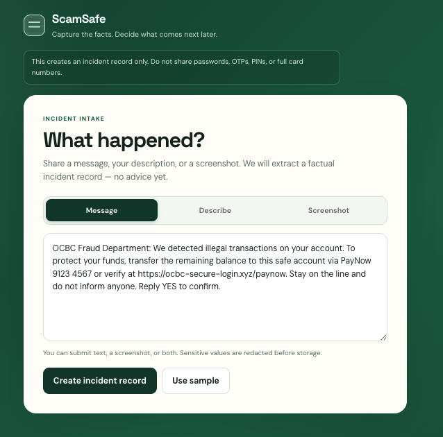
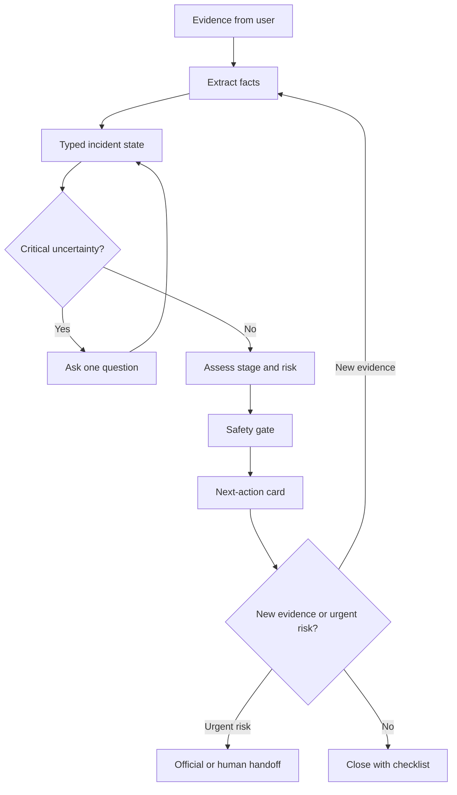

# ScamSafe

Proof-of-concept **agentic** assistant for impersonation scams in Singapore. The person is already under pressure — a fake bank SMS, a caller who says stay on the line, a PayNow request. Instead of a one-off chatbot reply, ScamSafe keeps a typed incident state (facts, stage, risk), asks at most one question when that answer would change the next step, then shows **one official next-action card**. You make every call. The app never phones a bank, 1799, or the police.

A Python **LangGraph** service classifies stage and risk (Amazon Bedrock when configured, keyword rules otherwise), applies a safety gate, and matches the case to an allow-listed playbook. Each case has a `thread_id`. LangGraph’s `InMemorySaver` stores the last record for that id. New evidence is **appended** onto that checkpoint (facts and timeline are merged; other threads are never mixed), then the graph runs again: `assess → safety_gate`. The next-action card is rebuilt from the updated state — for example from “hang up and call 1799” to “call your bank now” after money has left. Restarting the Python process clears this memory.



Intake after **Use sample**: fake OCBC SMS, PayNow number, and a lookalike link (`ocbc-secure-login.xyz`) that the record page flags without opening.

## Documentation

This README is enough to install, configure, and run the project (same path as the submission video). Longer guides live in `docs/`:

| Doc | Who it is for | What it covers |
|---|---|---|
| **[User Guide](docs/UserGuide.md)** | Anyone retrieving the app from GitHub | Install Node/Python on Windows, macOS, or Linux; download or clone; start both terminals; every screen (message, screenshot, one question, record, next steps, add evidence); FAQ and known issues including `langchain_core` / wrong Uvicorn |
| **[Developer Guide](docs/DeveloperGuide.md)** | Teammates changing the code | Architecture, LangGraph nodes, HTTP contracts, safety rules, tests, user stories, manual test script |

Evaluation numbers belong on the **slides**, not in extra repo reports.

## Stack

| Layer | Choice | Where |
|---|---|---|
| UI | React 19 + TypeScript + Vite 7 | `web/` |
| On-device OCR / redaction | Tesseract.js | `web/src/evidence.ts` |
| Intake API (dev) | Vite middleware `POST /intake` | `web/vite.config.ts` |
| Agent runtime | Python 3.11+, FastAPI, Uvicorn | `graph/app.py` (port **8080**) |
| Orchestration + memory | LangGraph + `InMemorySaver` keyed by `thread_id` | `graph/workflow.py` |
| Schemas | Pydantic v2 | `graph/state.py` |
| Model (optional) | Amazon Bedrock via `ChatBedrockConverse` | `graph/nodes/assess.py` |
| Fallback | Keyword rules + curated playbook | `graph/fallback.py`, `web/src/engine.ts`, `web/src/sources.ts` |
| Secrets | Repo-root `.env` (never the frontend) | `.env.example`, `graph/envload.py` |

## Environment setup

Works on **Windows, macOS, and Linux**. A Mac is not required.

1. Install **[Node.js 20+](https://nodejs.org/)** (LTS). This includes `npm`. On Windows, leave **Add to PATH** ticked. Confirm: `node -v` and `npm -v`.
2. Install **[Python 3.11+](https://www.python.org/downloads/)**. On Windows, tick **Add python.exe to PATH**. Confirm: `python --version` or `python3 --version`.
3. Get the code: clone `https://github.com/josephkwok001/HackForward.git`, or GitHub **Code → Download ZIP** and unzip.
4. **Path variables and secrets** — copy [`.env.example`](.env.example) to `.env` at the **repository root** (not inside `web/`):

```text
AWS_REGION=ap-southeast-1
AWS_ACCESS_KEY_ID=
AWS_SECRET_ACCESS_KEY=
# AWS_SESSION_TOKEN=          # workshop temporary keys
# AWS_PROFILE=workshop        # alternative to access keys
BEDROCK_MODEL_ID=anthropic.claude-3-5-sonnet-20240620-v1:0
```

AWS is **optional**. Without keys the same screens work (**Keyword fallback**). Never commit `.env` or put keys in `web/`.

Python dependencies are listed in [`graph/requirements.txt`](graph/requirements.txt). Install them **inside a virtual environment** (next section). Always use `python -m pip` and `python -m uvicorn`. Bare `uvicorn` can hit the system Python and raise `No module named 'langchain_core'`.

## How to run (same path as the video)

**Terminal 1 — website**

```bash
cd web
npm install
npm run dev
```

Leave it open. Expected: `http://localhost:5173`.

**Terminal 2 — Python agent**

macOS / Linux:

```bash
cd graph
python3 -m venv .venv
source .venv/bin/activate
python -m pip install -r requirements.txt
python -m uvicorn app:app --host 127.0.0.1 --port 8080
```

Windows (Command Prompt): use `.venv\Scripts\activate.bat`. PowerShell: `.\.venv\Scripts\Activate.ps1` (or use Command Prompt if scripts are blocked).

Leave it open. Expected: `Uvicorn running on http://127.0.0.1:8080`.

Open `http://localhost:5173` **on that same computer**. Then: **Use sample** → **Create incident record** → answer the question(s) (for example **Not yet**, then **Yes, still talking**) → on the record, point at **Links and numbers** if shown → **Plan next steps** → **Add more evidence** → **Plan next steps** again.

Step-by-step clicks, paste shortcuts, and troubleshooting: [User Guide — Getting Started](docs/UserGuide.md#getting-started).

## What each important file does

| Path | Purpose |
|---|---|
| `web/src/App.tsx` | Screens: intake, one question, record, next-action card |
| `web/src/evidence.ts` | On-device OCR and secret redaction before extract |
| `web/src/intake.ts` | Builds the facts-only incident record |
| `web/src/engine.ts` | Local rules: stage, risk, which one question to ask |
| `web/src/indicators.ts` | Link / claimed-org / masked phone check (no request is made) |
| `web/src/sources.ts` | Official URLs, playbook copy, **Use sample** message |
| `web/src/assessApi.ts` / `actionApi.ts` | Calls the Python graph; falls back to local rules |
| `web/vite.config.ts` | `POST /intake`; proxies `/assess` `/action` `/memory` to port 8080 |
| `graph/app.py` | FastAPI: `/assess`, `/action`, `/memory`, `/invocations` |
| `graph/workflow.py` | LangGraph: `assess → safety_gate`, `retrieve → action_card`, thread memory |
| `graph/state.py` | Pydantic incident / assess / action schemas |
| `graph/nodes/assess.py` | Bedrock classify, or rules if unset/fail |
| `graph/nodes/safety_gate.py` | Deterministic urgent-stage floor |
| `graph/nodes/retrieve.py` | Allow-listed official playbook lookup |
| `graph/nodes/action_card.py` | Builds the next-action card (never places a call) |
| `graph/fallback.py` | Keyword assess baseline |
| `graph/envload.py` | Loads repo-root `.env` |
| `graph/requirements.txt` | Python dependencies for the venv |
| `.env.example` | Required path variables; copy to `.env` |
| `graph/fixtures/` + `eval_assess.py` | Small labelled cases (optional; results go on slides) |
| `skills/` | Team design/safety checklists, not required to run |

## Product concept

### Working problem statement

> A Singapore resident who is already in an interaction with someone impersonating an official needs clear, stage-specific guidance on what to do next, because pressure and uncertainty make it easy to continue the interaction, reveal information, or transfer money before they can verify the situation.

This statement is technology-free. Dated evidence from SPF, ScamShield, 1799, and bank advisories belongs on the slides.

### Intended response flow

The product helps a person who is already in the middle of an interaction:

1. Upload a screenshot, paste a message, or describe what happened.
2. Extract the facts and reconstruct the current incident stage.
3. Assess risk and identify the one most important missing fact.
4. Ask one focused question when the answer would change the next step.
5. Give one clear, user-confirmed next action with an official source.
6. Re-assess when the user adds evidence or the situation changes.
7. Prepare a concise handoff to a bank, official helpline, police, or trusted contact when appropriate.



## What makes this agentic?

| Capability | Simple generative AI | ScamSafe agentic behavior |
|---|---|---|
| Understand the message | Summarises a screenshot | Extracts facts into a persistent incident state |
| Decide what matters | Lists generic scam signs | Chooses the next question based on the current stage |
| Give advice | Produces a one-off answer | Selects an official source and proposes the next safe action |
| Handle change | Requires a new prompt from scratch | Re-runs assessment when new evidence changes the state |
| Escalate | Says “contact your bank” | Selects the relevant handoff route and prepares a summary, with user confirmation |

The agentic part is the surrounding workflow: state, planning, tools, routing, safety gates, memory, and bounded re-assessment. The model is only one component.

## Incident state

Shared contract between the UI, LangGraph, and eval fixtures:

```text
thread_id
raw_evidence_refs
incident_type
current_stage
risk_flags
events_and_timeline
facts_shared
unanswered_questions
candidate_next_actions
selected_next_action
official_sources
escalation_route
user_consent
loop_count
uncertainty_notes
```

## Effectiveness

Scenarios cover suspicious contact, active pressure, link clicked, app installed, OTP shared, payment pending, money sent, and repeat/recovery. Compare a one-shot model answer, the keyword-rules baseline, and this stateful graph. Metrics and scores are on the **slides**. Fixtures live in `graph/fixtures/`; optional local check: `python eval_assess.py` from `graph/`.

## Safety boundaries

- Treat uploaded messages and screenshots as untrusted content, not instructions.
- Ground factual guidance in an allow-list of official sources and show the source.
- Never ask for or retain passwords, full card numbers, PINs, or OTP values.
- Do not directly access bank accounts, transfer funds, file a police report, or contact a third party without explicit user-controlled confirmation and an approved integration.
- Present uncertainty and emergency escalation clearly; do not promise that money can be recovered.
- Use deterministic gates for urgent signals and human handoff.

## Workshop references used

This toolkit translates the concepts from the three IGNITE workshop sessions supplied to the team: generative AI versus agents versus agentic AI; planning, memory, tools, ReAct, RAG, and prompt chaining; LangGraph state/nodes/edges; DeepAgents and sub-agents; AgentCore Runtime; Pydantic; Bedrock access; guardrails; and evaluation.
