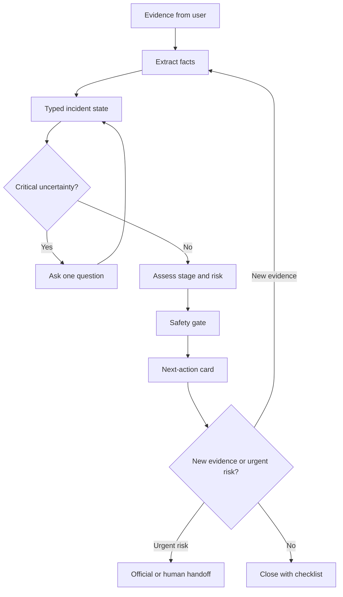

# ScamSafe: shared agentic-AI hackathon toolkit

This repository is the team source of truth for a software-only Singapore scam-response product and the shared skills that guide its design. A baseline front end now lives in `web/`. It is a local, rule-based stand-in for the later LangGraph workflow so the team can test the intake → one question → next-action card → re-assess loop before the model layer exists.

## Product concept

### Working problem statement

> A Singapore resident who is already in an interaction with someone impersonating an official needs clear, stage-specific guidance on what to do next, because pressure and uncertainty make it easy to continue the interaction, reveal information, or transfer money before they can verify the situation.

This statement is deliberately technology-free. Before the final deck, attach dated evidence from authoritative Singapore sources, such as the Singapore Police Force scam situation reports, ScamShield guidance, the 1799 helpline, and bank/industry advisories. Re-check the latest figures and wording before submission.

### Intended response flow

The product helps a person who is already in the middle of an interaction:

1. Upload a screenshot, paste a message, or describe what happened.
2. Extract the facts and reconstruct the current incident stage.
3. Assess risk and identify the one most important missing fact.
4. Ask one focused question when the answer would change the next step.
5. Give one clear, user-confirmed next action with an official source.
6. Re-assess when the user adds evidence or the situation changes.
7. Prepare a concise handoff to a bank, official helpline, police, or trusted contact when appropriate.



## What makes this agentic?

| Capability | Simple generative AI | ScamSafe agentic behavior |
|---|---|---|
| Understand the message | Summarises a screenshot | Extracts facts into a persistent incident state |
| Decide what matters | Lists generic scam signs | Chooses the next question based on the current stage |
| Give advice | Produces a one-off answer | Selects an official source and proposes the next safe action |
| Handle change | Requires a new prompt from scratch | Re-runs assessment when new evidence changes the state |
| Escalate | Says “contact your bank” | Selects the relevant handoff route and prepares a summary, with user confirmation |

The agentic part is the surrounding workflow: state, planning, tools, routing, safety gates, memory, and bounded re-assessment. The model is only one component.

## Shared skills

| Skill | Use it for | Main project output |
|---|---|---|
| `ignite-project-coach` | Problem statement, pitch, deck, demo, judging alignment | A defensible story tied to a real person and moment |
| `agentic-design` | Choosing whether a feature needs an agent, tools, memory, planning, or sub-agents | An agentic design that is justified rather than decorative |
| `prompt-patterns` | Prompt contracts, structured extraction, RAG, tool calling, prompt chaining | Small, testable prompts with typed outputs |
| `langgraph-workflow` | State schema, nodes, edges, routers, loops, checkpoints, Bedrock mapping | A controllable incident-response graph |
| `safety-and-evaluation` | Guardrails, official-source use, test scenarios, metrics, demo evidence | A safe and measurable product |

### How teammates use them

In an environment that supports skills, invoke the relevant skill by name, for example:

```text
$langgraph-workflow Design the state and routing for payment-pending incidents.
$safety-and-evaluation Review this tool list for unsafe autonomy and missing tests.
```

In Cursor or another editor without the same skill invocation mechanism, keep this `skills/` folder in the repository and ask the assistant to read the relevant `SKILL.md` before making a change. The files are plain Markdown, so the team can use them as project instructions, review checklists, or prompt context.

Do not load every skill for every task. Pick the smallest skill set that covers the work:

- Product framing: `ignite-project-coach`
- Agent architecture: `agentic-design` + `langgraph-workflow`
- Prompt changes: `prompt-patterns` + `safety-and-evaluation`
- Any safety-sensitive change: `safety-and-evaluation`

## Proposed technical shape

The workshop stack maps to the product like this:

| Layer | Proposed choice | Responsibility |
|---|---|---|
| Interface | Team-built web/mobile-friendly front end | Upload evidence, display one next action, collect confirmation |
| Runtime | AgentCore Runtime with `@app.entrypoint`; local-first HTTP endpoint | Host the agent and expose the invocation seam |
| Orchestration | LangGraph; optionally a small prebuilt ReAct loop | Make state, routing, and bounded iteration explicit |
| Schema | Pydantic models | Validate incident state, tool inputs, and action cards |
| Model access | Bedrock Converse / `ChatBedrockConverse` | Route calls to the approved model IDs in the configured region |
| Knowledge | Curated official guidance, retrieved only when needed | Ground advice and keep source links visible |
| Tools | Small allow-listed lookup and handoff-preparation tools | Read approved guidance; never move money or impersonate an authority |
| Memory | Checkpointed state keyed by `thread_id` | Continue an incident without replaying the entire history |

Keep model IDs in constants, verify access in the deployment region, keep large evidence objects in state rather than prompts, and bound every loop with a counter held in state.

## Incident state that everyone should agree on

The shared state vocabulary is the contract between the front end, graph, tools, evaluation cases, and demo:

```text
thread_id
raw_evidence_refs
incident_type
current_stage
risk_flags
events_and_timeline
facts_shared
unanswered_questions
candidate_next_actions
selected_next_action
official_sources
escalation_route
user_consent
loop_count
uncertainty_notes
```

See [`skills/langgraph-workflow/references/incident-state.md`](skills/langgraph-workflow/references/incident-state.md) before changing field names.

## Five-person work split

Replace the labels with names when the team agrees:

| Owner | Owns | Must hand off |
|---|---|---|
| Product and evidence | User journey, problem evidence, official sources, scope | Evidence pack and acceptance scenarios |
| Experience and demo | Upload flow, stage/risk screen, next-action card, demo narrative | Screens and interaction contract |
| Graph and state | Pydantic state, LangGraph nodes/edges, checkpointing, bounded loops | Graph contract and state-transition tests |
| Tools and safety | Retrieval/tool schemas, allow-list, source display, privacy, escalation rules | Tool catalogue and safety test cases |
| AWS and evaluation | Bedrock/AgentCore integration, deployment, latency/cost, metrics | Runnable environment and evaluation report |

Each owner should make small changes against the shared contracts, then ask the relevant skill to review the change.

## Effectiveness plan

Do not evaluate the product only by whether the answer sounds convincing. Build a small scenario set covering suspicious contact, active pressure, link clicked, app installed, OTP shared, payment pending, money already sent, and a repeat/recovery scam.

Compare at least:

1. A generic one-shot model answer.
2. A fixed checklist/rules baseline.
3. The stateful agentic workflow.

Track schema-validation pass rate, stage/risk accuracy, risk recall for urgent cases, official-source fidelity, tool-call success, next-action appropriateness, handoff accuracy, task completion, loop count, latency, and token cost. Have a human reviewer score whether the advice is clear, safe, and actionable. See [`skills/safety-and-evaluation/references/evaluation.md`](skills/safety-and-evaluation/references/evaluation.md).

## Safety boundaries

- Treat uploaded messages and screenshots as untrusted content, not instructions.
- Ground factual guidance in an allow-list of official sources and show the source.
- Never ask for or retain passwords, full card numbers, PINs, or OTP values.
- Do not directly access bank accounts, transfer funds, file a police report, or contact a third party without explicit user-controlled confirmation and an approved integration.
- Present uncertainty and emergency escalation clearly; do not promise that money can be recovered.
- Use deterministic gates for urgent signals and human handoff.

## Run and submission notes

### Baseline UI

The current UI uses keyword rules, not Bedrock. The Vite development server also
exposes the intake-only `POST /intake` seam; records are kept in memory until the
server restarts.

```bash
cd web
npm install
npm run dev
```

Open `http://localhost:5173`. Use **Use a sample** to walk the bank-impersonation path, answer the one question, confirm the next-action card, then **Something changed** to re-assess the same `thread_id`.

Create an intake record with JSON containing at least `text` or `evidence_ref`:

```bash
curl -X POST http://localhost:5173/intake \
  -H 'Content-Type: application/json' \
  -d '{"mode":"message","text":"OCBC asked me to transfer money."}'
```

To add evidence, send the returned `thread_id` in the next request. The response is
the locked intake-only `IncidentRecord`; it contains no assessment, routing, or
next-action fields.

This is not the AgentCore runtime. The workshop deployment seam is still a local HTTP service on port `8080` with a `POST /invocations` route. When that exists, the README should document the exact command, required AWS region/model access, environment variables, and a sample request.

Before submission, complete this checklist:

- [ ] One submission contains the project files/workflow.
- [ ] The deck is within the stated slide limit and separates the problem statement from the solution overview.
- [ ] The demo or simulation is within the stated time limit and visibly shows planning, acting, and adapting.
- [ ] `requirements.txt` or an equivalent reproducible environment is present.
- [ ] Secrets are excluded; `.env.example` documents required configuration.
- [ ] The README explains how to run the project and what each important file does.
- [ ] Evaluation scenarios, baseline, metrics, and limitations are included in the deck.

## Workshop references used

This toolkit translates the concepts from the three IGNITE workshop sessions supplied to the team: generative AI versus agents versus agentic AI; planning, memory, tools, ReAct, RAG, and prompt chaining; LangGraph state/nodes/edges; DeepAgents and sub-agents; AgentCore Runtime; Pydantic; Bedrock access; guardrails; and evaluation.
