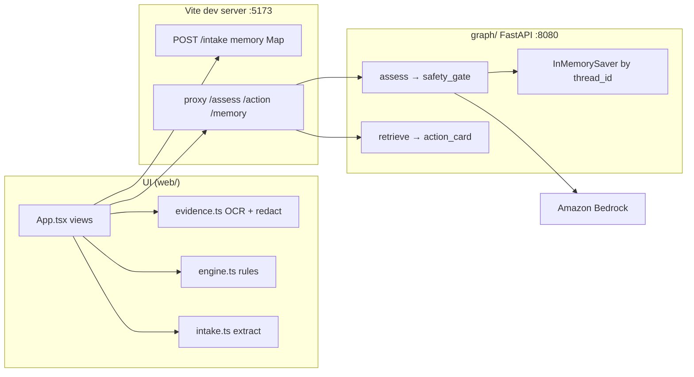
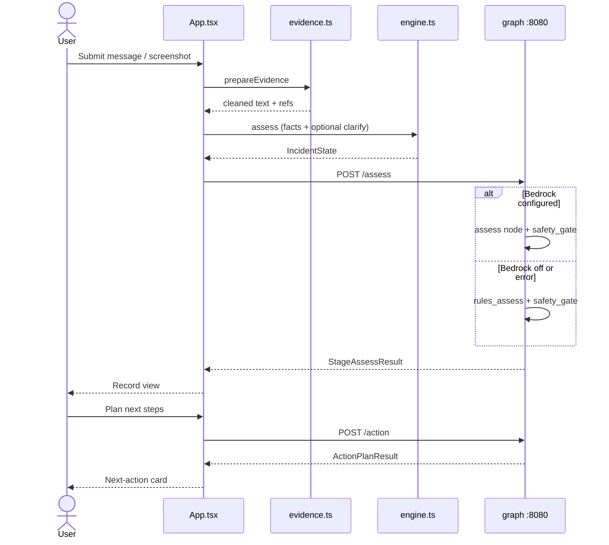

# ScamSafe Developer Guide

---

## Acknowledgements

ScamSafe is a software-only Singapore scam-response prototype built for the IGNITE / HackForward workshop. It applies workshop ideas (agentic workflows, LangGraph state, Bedrock, guardrails, evaluation) to a concrete intake → assess → next-action loop.

Libraries and resources used include:

1. [React](https://react.dev/) and [Vite](https://vite.dev/)
2. [Tesseract.js](https://tesseract.projectnaptha.com/) (on-device OCR)
3. [FastAPI](https://fastapi.tiangolo.com/) and [Uvicorn](https://www.uvicorn.org/)
4. [LangGraph](https://langchain-ai.github.io/langgraph/) and [LangChain AWS](https://python.langchain.com/docs/integrations/chat/bedrock/)
5. [Pydantic](https://docs.pydantic.dev/)
6. Official public guidance from [ScamShield](https://www.scamshield.gov.sg/) and the [Singapore Police Force](https://www.police.gov.sg/)
7. Team skills under [`skills/`](../skills/) (`ignite-project-coach`, `agentic-design`, `prompt-patterns`, `langgraph-workflow`, `safety-and-evaluation`)

---

## Setting up, getting started

To **download the repo and run the app**, follow [User Guide — Getting Started](UserGuide.md#getting-started). That is the supported path for anyone retrieving ScamSafe from GitHub (Windows, macOS, or Linux).

This section only adds developer extras: optional Bedrock `.env`, health checks, and where not to put secrets.

### Prerequisites

| Tool | Why | Notes |
|---|---|---|
| [Node.js](https://nodejs.org/) 20 or newer | Front end (`web/`) | Installer for Windows / macOS, or your distro package on Linux. Confirm with `node -v`. |
| [Python](https://www.python.org/) 3.11+ | Assess / action graph (`graph/`) | On Windows, tick **Add python.exe to PATH** in the installer. Confirm with `python --version` or `python3 --version`. |
| A browser | Open `http://localhost:5173` | Chrome, Edge, Firefox, or Safari. |
| Optional: AWS credentials + Bedrock model access | Feature 2 model classify | Workshop region is typically `ap-southeast-1`. Without this, keyword rules still run. |

You do **not** put AWS keys in `web/` or any frontend file.

### 1. Get the repository

```bash
git clone <this-repo-url>
cd HackForward
```

Or download a ZIP from GitHub (**Code → Download ZIP**) and unzip it. File Explorer (Windows), Finder (macOS), or your file manager (Linux) all work.

### 2. Front end

```bash
cd web
npm install
npm run dev
```

From the repo root you can also run `npm install` once in `web/`, then `npm run dev` from the root (it forwards to `web/`).

Expected: Vite listens on **port 5173** (`strictPort: true`). Open `http://localhost:5173` on **the same machine**.

> [!TIP]
> **Tip (Windows):** Use **Command Prompt**, **PowerShell**, or Windows Terminal. `cd` into the folder the same way. If `npm` is not found, reopen the terminal after installing Node.js.

### 3. Assess / action graph (Features 2, 3, 5)

Open a **second** terminal.

**macOS / Linux:**

```bash
cd graph
python3 -m venv .venv
source .venv/bin/activate
python -m pip install -r requirements.txt
python -m uvicorn app:app --host 127.0.0.1 --port 8080
```

**Windows (Command Prompt):**

```bat
cd graph
python -m venv .venv
.venv\Scripts\activate.bat
python -m pip install -r requirements.txt
python -m uvicorn app:app --host 127.0.0.1 --port 8080
```

**Windows (PowerShell):**

```powershell
cd graph
python -m venv .venv
.\.venv\Scripts\Activate.ps1
python -m pip install -r requirements.txt
python -m uvicorn app:app --host 127.0.0.1 --port 8080
```

Use `python -m uvicorn`, not bare `uvicorn`. Otherwise macOS can launch `/Library/Frameworks/Python.framework/.../uvicorn` and raise `No module named 'langchain_core'`.

If PowerShell blocks the activate script, run `Set-ExecutionPolicy -Scope CurrentUser RemoteSigned` once, or use Command Prompt instead.

Copy [`.env.example`](../.env.example) to `.env` at the **repository root** (not inside `web/`):

```text
AWS_REGION=ap-southeast-1
AWS_ACCESS_KEY_ID=
AWS_SECRET_ACCESS_KEY=
# AWS_SESSION_TOKEN=          # workshop temporary keys
# AWS_PROFILE=workshop        # alternative to access keys
BEDROCK_MODEL_ID=anthropic.claude-3-5-sonnet-20240620-v1:0
```

Check `GET http://127.0.0.1:8080/health`. `bedrock` is `configured` or `off`.

CORS allows only `http://localhost:5173` and `http://127.0.0.1:5173`.

### 4. Smoke the loop

1. Open `http://localhost:5173` on the **host** machine.
2. Click **Use sample** → **Create incident record** → **Plan next steps**.
3. Optional API checks:

```bash
curl -s http://127.0.0.1:8080/health

curl -X POST http://localhost:5173/intake ^
  -H "Content-Type: application/json" ^
  -d "{\"mode\":\"message\",\"text\":\"OCBC asked me to transfer money.\"}"
```

On macOS / Linux, use `\` line continuations instead of `^`, and single-quoted JSON.

The UI still works if port **8080** is down: `seedFromRules()` / `seedAction()` fill the same shapes.

> [!WARNING]
> **Caution:** Never commit `.env`. Do not paste workshop keys into Slack, the deck, or frontend source.

---

## Design

### Architecture

The Architecture Diagram below explains the high-level design.



**Main components**

* [**UI**](#ui-component): React views (intake, prepare, working, clarify, record, plan).
* [**Intake / Logic (client)**](#logic-component-client): Evidence prep, extraction, keyword assess seed, local playbook seed.
* [**Graph / Logic (server)**](#logic-component-server): LangGraph assess and action graphs hosted by FastAPI.
* [**Model**](#model-component): Shared incident vocabulary (`types.ts` + `graph/state.py`).
* [**Storage**](#storage-component): In-process maps and LangGraph checkpoints. No durable disk store in this prototype.

**How the components interact**

The sequence below is the happy path after the user clicks **Create incident record**.



If `POST /assess` or `POST /action` fails, the UI keeps the keyword seed so the record / card never goes blank.

---

### UI component

**Primary module:** [`web/src/App.tsx`](../web/src/App.tsx)

Views are a finite set: `intake` | `preparing` | `working` | `clarify` | `record` | `planning` | `plan`.

The UI component:

* Collects `mode` (`message` | `describe` | `screenshot`), text, and an optional file.
* Calls `prepareEvidence` before any extract (OCR + redaction). Person 3 only sees cleaned text plus `raw_evidence_refs`.
* Seeds stage/risk with `seedFromRules`, then overwrites from `fetchAssess` when the graph is up.
* Seeds the playbook with `seedAction` / `actionFor()` when `fetchAction` fails.
* Never places a phone call or opens a scam link for inspection (`indicators.ts` is local string checks only).

Supporting modules:

| File | Role |
|---|---|
| `web/src/evidence.ts` | Tesseract OCR, redaction, file refs |
| `web/src/intake.ts` | Intake-only `IncidentRecord` extract |
| `web/src/engine.ts` | Facts, one clarification, keyword stage/risk |
| `web/src/assessApi.ts` | `POST /assess` client |
| `web/src/actionApi.ts` | `POST /action` client |
| `web/src/indicators.ts` | Link / claimed-org / masked phone display |
| `web/src/sources.ts` | Official URLs and fallback playbooks |
| `web/vite.config.ts` | `POST /intake` middleware; proxies graph paths |

---

### Logic component (client)

**API-shaped modules:** `intake.ts`, `engine.ts`, `assessApi.ts`, `actionApi.ts`

How a create-record click is executed:

1. `App` validates that text or a file exists.
2. `prepareEvidence` redacts secrets and, if needed, reads the screenshot on-device.
3. `engine.assess` builds / merges `IncidentState` (facts, timeline, optional `needs_clarification`).
4. `fetchAssess(toAssessRequest(state))` asks the graph; on failure the keyword seed remains.
5. If `shouldAsk(state)`, the UI shows **one** question; otherwise it opens the record.

`IncidentRecord` (intake) must **not** grow assessment, routing, or action fields. That lock is the contract between Person 1 (UI) and Person 3 (graph).

---

### Logic component (server)

**HTTP API:** [`graph/app.py`](../graph/app.py)

| Method | Path | Body / result |
|---|---|---|
| `GET` | `/` | Service index |
| `GET` | `/health` | `bedrock` configured/off, region, model |
| `POST` | `/assess` | `AssessInput` → `AssessResult` |
| `POST` | `/action` | `ActionInput` → `ActionResult` |
| `POST` | `/invocations` | Same handler as `/assess` (AgentCore-shaped seam) |
| `GET` | `/memory/{thread_id}` | Counts / last stage only (404 if unknown) |

**Assess graph** (`graph/workflow.py`): `START → assess → safety_gate → END`, compiled with `InMemorySaver` keyed by `thread_id`.

**Action graph:** `START → retrieve → action_card → END`.

`invoke_assess` loads the checkpoint for that `thread_id`, runs `merge_thread_memory`, then invokes the graph. Different thread IDs are never mixed. Restarting Uvicorn clears memory.

Vite proxies `/assess`, `/action`, and `/memory` from `:5173` to `:8080`. Intake stays on Vite: `POST /intake` (JSON, ~25 KB cap) stores `IncidentRecord` in a process-local `Map`.

---

### Model component

**TypeScript:** [`web/src/types.ts`](../web/src/types.ts)<br>
**Pydantic:** [`graph/state.py`](../graph/state.py)

Shared vocabulary (do not rename casually; see [`skills/langgraph-workflow/references/incident-state.md`](../skills/langgraph-workflow/references/incident-state.md)):

```text
thread_id, raw_evidence_refs, incident_type, current_stage, risk_flags,
events_and_timeline, facts_shared, unanswered_questions,
candidate_next_actions, selected_next_action, official_sources,
escalation_route, user_consent, loop_count, uncertainty_notes
```

**Stages:** `suspicious_contact`, `active_pressure`, `link_clicked`, `app_installed`, `otp_shared`, `payment_pending`, `money_sent`, `repeat_recovery`, `unknown`.

**Risk flags:** `requested_transfer`, `requested_otp`, `requested_remote_access`, `impersonating_official`, `payment_in_progress`, `funds_already_moved`, `user_still_on_the_call`, `insufficient_evidence`.

The Model does not depend on React or FastAPI. Both runtimes validate the same literals so a fixture in `graph/fixtures/assess_cases.json` can be reasoned about from the UI.

---

### Storage component

There is no production database.

* **Intake:** `Map<thread_id, IncidentRecord>` inside the Vite plugin. Dies when `npm run dev` stops.
* **Assess memory:** LangGraph `InMemorySaver` (or `MemorySaver` fallback). Dies when Uvicorn stops.
* **Browser:** React state only. Refresh starts over.
* **Secrets:** `.env` at repo root, loaded by `graph/envload.py`. Listed in `.gitignore`.

`GET /memory/{thread_id}` returns metadata (`memory_turn_count`, `last_stage`, `loop_count`) and never the stored texts.

---

## Implementation

This section describes noteworthy details on how certain features are implemented.

### Evidence preparation and redaction

#### Implementation

Person 2 runs **before** extract. `prepareEvidence` in `web/src/evidence.ts` turns a description, transcript, or screenshot into cleaned text plus file references.

**Key pieces:**

* `redactSensitive` — card-like 13–19 digit runs, 6-digit codes when OTP context is present, `password:` / `PIN:` values
* `neutralizeUntrusted` — strips “ignore previous instructions” / “system prompt” style jailbreak phrases
* Tesseract.js OCR on-device; weak / failed OCR sets `needs_caption` so the user must type what the image says
* Image size cap (`MAX_IMAGE_BYTES`); screenshots are **references**, not uploaded bytes to Person 3

**Design considerations**

**Aspect: Where OCR runs**

* **Current:** In the browser with Tesseract.js.
  * Pros: Image need not leave the device; matches the privacy story in the User Guide.
  * Cons: Slower and less accurate than a server OCR stack; fails on blurry photos (documented as a known issue).
* **Alternative:** Server-side OCR.
  * Pros: Quality.
  * Cons: Uploads scam screenshots (often PII-adjacent) to the helper’s machine; larger safety review.

**Aspect: What to redact**

* **Current:** High-precision patterns (PAN-like numbers, contextual 6-digit codes, explicit password/PIN assignments).
  * Pros: Fewer false wipes of dates and phone fragments.
  * Cons: A user can still type an OTP in prose without the word “OTP”.
* **Alternative:** Redact every 6-digit token.
  * Pros: Safer default.
  * Cons: Drops amounts, times, and case IDs the assess node needs.

---

### Stage and risk assessment

#### Implementation

After Feature 1 builds the incident record, Feature 2 classifies `current_stage` and `risk_flags`.

**Key pieces:**

* `nodes.assess.run_assess` — Bedrock `ChatBedrockConverse` + structured `AssessLLMOutput` when configured; else `fallback.rules_assess`
* On any Bedrock exception, the same rules baseline is returned with an uncertainty note
* `nodes.safety_gate.apply_urgent_gate` — deterministic regex/rank floor so the model cannot *downgrade* money-sent / OTP-shared / remote-access facts
* Client `engine.ts` mirrors stage rank and keyword rules so the record page can render before / without 8080

**How it works:**

1. UI posts `StageAssessRequest` (`thread_id`, facts, timeline, `incident_type`).
2. `merge_thread_memory` appends unique events (cap `MAX_MEMORY_EVENTS = 40`).
3. `assess` node runs Bedrock or rules.
4. `safety_gate` may raise stage and add flags from the haystack.
5. Response includes `source` (`bedrock` | `rules`), `loop_count`, `memory_turn_count`.

**Design considerations**

**Aspect: Model versus rules**

* **Current:** Model when configured; rules as equal-shaped fallback.
  * Pros: Demo still works on a judge laptop with no AWS; eval can compare both (`eval_assess.py`).
  * Cons: Two classifiers can disagree; UI must show the badge honestly.
* **Alternative:** Fail closed if Bedrock is down.
  * Pros: One code path.
  * Cons: Demo dies in the most common workshop failure mode (missing keys).

**Aspect: Safety gate before or after the model**

* **Current:** After assess, as a separate graph node.
  * Pros: Deterministic override; testable without AWS; matches “urgent signals are not a vibe”.
  * Cons: Gate and model can both emit notes the UI must de-duplicate.

---

### Next-action card

#### Implementation

Feature 3 is `retrieve → action_card`.

* `run_retrieve` picks `escalation_route` from stage/flags, loads an allow-listed official pack, and sets `retrieval_failed` if a URL is not in `ALLOWED_URLS`.
* `run_action_card` builds `selected_next_action` (title, steps, source). If the source URL is not allow-listed, it snaps back to ScamShield.
* The app **never** places a call. The UI checkbox is user acknowledgement only.
* Client `actionFor()` in `web/src/sources.ts` is the offline twin of the playbook.

**Design considerations**

**Aspect: Generated advice versus playbook table**

* **Current:** Curated playbook keyed by stage/route; model is not asked to invent steps.
  * Pros: Official-source fidelity; cheap; safe for a hackathon demo.
  * Cons: Wording is coarse; new scam types need a table edit.
* **Alternative:** LLM-written steps grounded by RAG.
  * Pros: More tailored copy.
  * Cons: Hallucinated numbers/URLs; needs a heavier eval harness (see `skills/safety-and-evaluation`).

---

### Follow-up memory

#### Implementation

Feature 5 uses LangGraph checkpoints keyed by `thread_id`.

* `merge_thread_memory` refuses to merge two different IDs.
* Facts are de-duplicated while preserving order; timeline events are unique on `(time_hint, actor, observation)`.
* `memory_status` exposes counts only.
* The UI **Add more evidence** path reuses the in-browser `IncidentState` as `prior` and re-posts assess.

Restarting Python is expected to clear memory. That is documented in the User Guide known issues.

**Design considerations**

**Aspect: Isolation boundary**

* **Current:** `thread_id` only.
  * Pros: Simple demo story; no user accounts.
  * Cons: Guessable IDs if the API is exposed beyond localhost.
* **Alternative:** Signed session + durable store.
  * Pros: Real product.
  * Cons: Out of scope for the workshop slice.

---

## Documentation, logging, testing, configuration

### Documentation

| Doc | Audience |
|---|---|
| [User Guide](UserGuide.md) | Retrieve the repo from GitHub, run it, use the features |
| This Developer Guide | Teammates adding features, running demos, writing eval |
| [README](../README.md) | Pitch, agentic rationale, submission checklist |
| `skills/*/SKILL.md` | Design / safety review before a change |

Do not load every skill for every task. Smallest set:

* Product / pitch: `ignite-project-coach`
* Graph and state: `agentic-design` + `langgraph-workflow`
* Prompts: `prompt-patterns` + `safety-and-evaluation`
* Any safety-sensitive change: `safety-and-evaluation`

### Testing

```bash
# UI contracts (Node test runner)
cd web
npm test

# Graph
cd graph
python -m unittest test_assess.py
python -m unittest test_action.py

# Rules vs Bedrock on labelled fixtures
python eval_assess.py
```

When you add a stage or flag, update `types.ts`, Pydantic literals, `web/src/sources.ts` labels, fixtures, and tests in the **same** change.

### Configuration

| Variable | Where | Purpose |
|---|---|---|
| `AWS_REGION` | repo-root `.env` | Bedrock region |
| `AWS_ACCESS_KEY_ID` / `AWS_SECRET_ACCESS_KEY` / `AWS_SESSION_TOKEN` | `.env` | Workshop keys |
| `AWS_PROFILE` | `.env` | Alternative to access keys |
| `BEDROCK_MODEL_ID` | `.env` | Approved model id constant — do not hard-code in the UI |

### Typical change recipes

| Change | Touch | Also read |
|---|---|---|
| Intake fields | `web/src/intake.ts`, `types.ts`, `web/tests/intake.test.ts` | Keep assess fields off `IncidentRecord` |
| Stage / risk labels | `web/src/sources.ts`, `graph/nodes/assess.py`, prompts | `skills/prompt-patterns` |
| Clarification | `web/src/engine.ts`, clarify view | One question only |
| Playbook copy or URL | `web/src/sources.ts`, `graph` retrieve / action_card | Official allow-list |
| Memory merge | `graph/workflow.py`, add-evidence path | Do not mix thread IDs |
| Deploy seam | keep `POST /invocations` on 8080 | Local-first; AgentCore later |

---

## Appendix: Requirements

### Product scope

**Target user profile:**

* Singapore resident already in an interaction with someone impersonating an official
* Under time pressure; may be on a call or chat
* Has a phone or PC and can open a website
* Must **not** be asked to install developer tooling
* Must take official next steps themselves (bank / 1799 / SPF)

**Value proposition:** Stage-specific guidance on what to do **next**, because pressure and uncertainty make it easy to keep talking, reveal information, or transfer money before verification.

### User stories

Priorities: High (must have) — `* * *`, Medium (nice to have) — `* *`, Low — `*`

| Priority | As a … | I want to … | So that I can… |
|---|---|---|---|
| `* * *` | resident in an active scam | paste a message or describe what happened | get a factual record without giving advice yet |
| `* * *` | resident with only a phone photo | attach a screenshot | capture evidence without typing everything |
| `* * *` | resident | see the current stage and risk flags | understand urgency in plain language |
| `* * *` | resident | get one official next-action card | know the next safe step and its source |
| `* * *` | resident | be told that I must make the call | not wait for the app to contact a bank |
| `* * *` | first-time demo viewer | run a sample message | walk the loop without a real incident |
| `* *` | resident whose situation changed | add more evidence to the same case | have stage and risk re-assessed |
| `* *` | resident with one missing fact | answer a single clarification question | get a more accurate next step |
| `* *` | resident | see links and numbers without the app opening them | avoid clicking a phishing URL |
| `* *` | resident | have secrets redacted | avoid storing OTPs, PANs, PINs, passwords |
| `* *` | Windows / Android user | use the same flow as a Mac user | not be blocked by the team’s laptops |
| `*` | judge / helper without AWS | still see a record and playbook | demo when Bedrock is unset |
| `*` | teammate | compare rules vs Bedrock on fixtures | show an effectiveness plan |

### Use cases

For all use cases below, the **System** is `ScamSafe` and the **Actor** is the `resident`, unless specified otherwise.

**Use case UC01: Create an incident from a message**

**Preconditions:** The ScamSafe page is open in a browser.

**Guarantees:** If successful, an incident record exists for a new or existing `thread_id`. Secrets matching redaction patterns are not stored in the clear.

**MSS**

1. Resident opens the **Message** tab.
2. Resident pastes the SMS / chat / email.
3. Resident chooses **Create incident record**.
4. System prepares evidence, extracts facts, assesses stage/risk, and shows the record (or one question first).

**Extensions**

* 2a. Text and file are both empty.
  * 2a1. System shows an error and stays on intake.
* 3a. Graph is down.
  * 3a1. System uses keyword fallback and still shows a record.

---

**Use case UC02: Create an incident from a screenshot**

**Preconditions:** The page is open; the device can pick an image.

**MSS**

1. Resident opens **Screenshot** and chooses an image.
2. System reads text on-device and redacts secrets.
3. System extracts and assesses as in UC01.

**Extensions**

* 2a. OCR is weak or failed.
  * 2a1. System asks the resident to type what the screenshot says.
  * Use case resumes at step 3 after caption is provided.

---

**Use case UC03: Answer one clarification question**

**Preconditions:** Extract set `needs_clarification` and at least one `unanswered_questions` item.

**MSS**

1. System shows one question with choices.
2. Resident picks a choice.
3. System updates the state and shows the record.

**Extensions**

* 2a. Resident chooses **Skip and see the record**.
  * 2a1. System shows the record without that answer.

---

**Use case UC04: Plan next steps**

**Preconditions:** A record with stage and risk exists.

**Guarantees:** The card cites an allow-listed official URL. The system does not contact a third party.

**MSS**

1. Resident chooses **Plan next steps**.
2. System retrieves the playbook (graph or local table).
3. System shows 1–3 steps and a source link.
4. Resident optionally ticks the acknowledgement checkbox.

---

**Use case UC05: Add more evidence**

**Preconditions:** A current case is on screen.

**Guarantees:** New facts append to the same `thread_id`. Another thread is not merged.

**MSS**

1. Resident chooses **Add more evidence**.
2. Resident submits new text and/or an image.
3. System re-extracts, re-assesses, and updates history.

**Extensions**

* 1a. Resident chooses **Go back**.
  * 1a1. System returns to the last record or plan without changing memory.

---

**Use case UC06: Start over**

**MSS**

1. Resident chooses **Start a new record** or **Start over**.
2. System clears on-screen state and returns to empty intake.

---

### Non-Functional Requirements

1. **Technical**
   1. The user-facing product shall be usable in a browser on Windows, macOS, Linux, Chromebook, iOS, and Android without an OS-specific installer.
   2. Developer setup shall be documented for Windows, macOS, and Linux.
   3. AWS credentials shall never be shipped in the frontend bundle.
   4. Intake extraction shall not emit assessment or action fields.
   5. Graph loops shall be bounded (`loop_count` / memory event cap).
   6. `POST /invocations` shall remain the AgentCore-shaped seam.

2. **Safety and privacy**
   1. User text and OCR output are untrusted data, not instructions.
   2. The system shall not ask for or persist passwords, full PANs, PINs, or OTP values.
   3. Next actions shall be grounded in an allow-list of official sources with the URL visible.
   4. No tool may transfer funds, file a police report, or contact a third party.
   5. Urgent signals shall use deterministic gates, not model tone alone.
   6. The product shall not promise that money can be recovered.

3. **Usability**
   1. A user who can install Node.js and Python shall be able to run the sample path from the User Guide without writing code.
   2. Error copy shall tell the user what to do next (type the screenshot, check the terminals are running, use 1799).
   3. The UI shall state that ScamSafe will not call a bank, 1799, or the police.

4. **Performance (prototype)**
   1. Keyword fallback shall produce a record even when Bedrock latency is unbounded or the graph is down.
   2. The UI may insert a short minimum wait so the working screens are readable in a demo; this is cosmetic, not a safety gate.

---

## Glossary

| Term | Meaning |
|---|---|
| **Incident state** | Shared typed record consumed by UI, graph, tools, and eval. |
| **Thread ID** | Isolation key for one case and its LangGraph checkpoint. |
| **Assess graph** | `assess → safety_gate` on port 8080. |
| **Action graph** | `retrieve → action_card` on port 8080. |
| **Safety gate** | Deterministic stage/flag floor after the model or rules. |
| **Keyword fallback / rules baseline** | Regex/word classifier used when Bedrock is off or fails. |
| **Playbook** | Curated official steps keyed by stage and escalation route. |
| **Intake lock** | Constraint that `IncidentRecord` has no advice fields. |
| **AgentCore seam** | `POST /invocations` alias of `/assess` for later hosting. |
| **Helper** | Developer who runs Vite / Uvicorn for a demo. |

---

## Appendix: Planned Enhancements

**Team size: 5** (product/evidence, experience/demo, graph/state, tools/safety, AWS/evaluation)

1. **Durable memory.** Replace process-local Maps / `InMemorySaver` with a checkpoint store that survives restart.
   * Current: Refresh or Uvicorn restart wipes the case.
   * Planned: Same `thread_id` resumes after a helper restart, still without mixing IDs.
2. **Hosted demo URL.** Ship a single HTTPS link so phone users are not stuck on `localhost`.
   * Current: Judges on phones cannot open the helper’s `localhost`.
   * Planned: Shared origin with the same UI; keys stay server-side.
3. **Richer OCR fallback.** Offer a forced “type what you see” field as soon as confidence is low, instead of failing the submit.
4. **Handoff pack.** User-confirmed summary the resident can copy to 1799 / the bank (still no auto-dial).
5. **Confirmation before Start over.** Avoid wiping a live demo with one tap.
6. **Stronger eval report.** Always-on comparison of one-shot model vs rules vs graph (schema pass rate, risk recall, source fidelity, loop count, latency).

---

## Appendix: Instructions for manual testing

> [!NOTE]
> **Note:** These instructions are a starting point. Testers should also do exploratory testing on Windows **and** a phone if a reachable URL exists.

### Launch

1. Start Vite (`web`, port 5173) on Windows, macOS, or Linux.
2. Open `http://localhost:5173` **on that same machine**.<br>
   Expected: **What happened?** with Message / Describe / Screenshot tabs.
3. Do **not** open `localhost` on a second device unless you have a shared host URL.<br>
   Expected: Connection error on the second device (known issue).

### Sample path

1. Click **Use sample**, then **Create incident record**.<br>
   Expected: Working screens, then clarify **or** record. Stage and at least one risk flag related to transfer / impersonation.
2. If a question appears, skip it.<br>
   Expected: Record still opens.
3. Click **Plan next steps**.<br>
   Expected: 1–3 steps, official source link, checkbox. No dialler.

### Screenshot path

1. **Screenshot** tab, attach a clear SMS photo, create record.<br>
   Expected: Preview; optional “read from the screenshot” notice; secrets redacted if present.
2. Attach a blank or tiny image.<br>
   Expected: Prompt to type what it says; no crash.

### Empty submit

1. Click **Create incident record** with empty text and no file.<br>
   Expected: Error: add a message, description, or screenshot. Stay on intake.

### Add evidence

1. From a sample record, **Add more evidence**, type that they now asked to PayNow, **Add to this case**.<br>
   Expected: History has a second step; stage/risk may rise; previous card is cleared.
2. **Go back** from add-evidence without submitting.<br>
   Expected: Previous record/plan unchanged.

### Graph down

1. Stop Uvicorn. Repeat the sample path.<br>
   Expected: Badge **Keyword fallback**; record and playbook still appear.

### Graph up, Bedrock off

1. Start Uvicorn with empty AWS fields. `GET /health` shows `bedrock: off`. Sample path.<br>
   Expected: Assess still returns; `source` is rules.

### Memory isolation

1. `POST /assess` twice with the same `thread_id` and extra timeline events, then `GET /memory/{id}`.<br>
   Expected: `memory_turn_count` ≥ 2.
2. `POST /assess` with a **different** `thread_id`.<br>
   Expected: That thread does not contain the first thread’s observations.

### Safety

1. Paste a message containing `password: hunter2` and a 16-digit card-like number.<br>
   Expected: Redaction notice; values not shown in full on the record.
2. Confirm the action card source is ScamShield, 1799 guidance, or SPF — not a number from the message.

### Start over

1. **Start a new record**.<br>
   Expected: Empty intake. Previous history gone.

---

## Appendix: Effort

### Difficulty and challenges

ScamSafe is not a CRUD address book. The hard part is a **bounded agentic loop** that stays safe under social-engineering text.

**Key challenges:**

1. **Split runtime.** React intake and Python LangGraph must share one vocabulary (`thread_id`, stages, flags) without leaking assess fields into Feature 1 records.
2. **Untrusted input.** Messages and OCR output may contain jailbreak phrases, OTPs, and PAN-like numbers. Redaction and neutralization run *before* the model sees text.
3. **Graceful degradation.** Workshop laptops often lack Bedrock. Rules and playbook tables are first-class, not an afterthought — otherwise the demo is a single point of failure.
4. **Non-autonomy.** The product must look helpful without calling anyone, opening scam links, or promising recovery. That constraint is enforced in copy, playbooks, and the action graph allow-list.
5. **Cross-OS demo.** Helpers and judges are not all on macOS. Setup and the User Guide have to treat Windows and phones as normal, not footnotes.

### Reuse

* Workshop patterns: LangGraph nodes/edges, Pydantic structured output, Bedrock Converse, AgentCore-shaped `/invocations`.
* Official public URLs rather than scraped pages.
* Shared `skills/` as review checklists instead of ad-hoc prompt dumps.

### What is intentionally unfinished

* Persistent store and accounts
* AgentCore hosting (contract exists; runtime is local Uvicorn)
* Any integration that actually contacts a bank or 1799
* Production auth, rate limits, and a long-term PII retention policy
